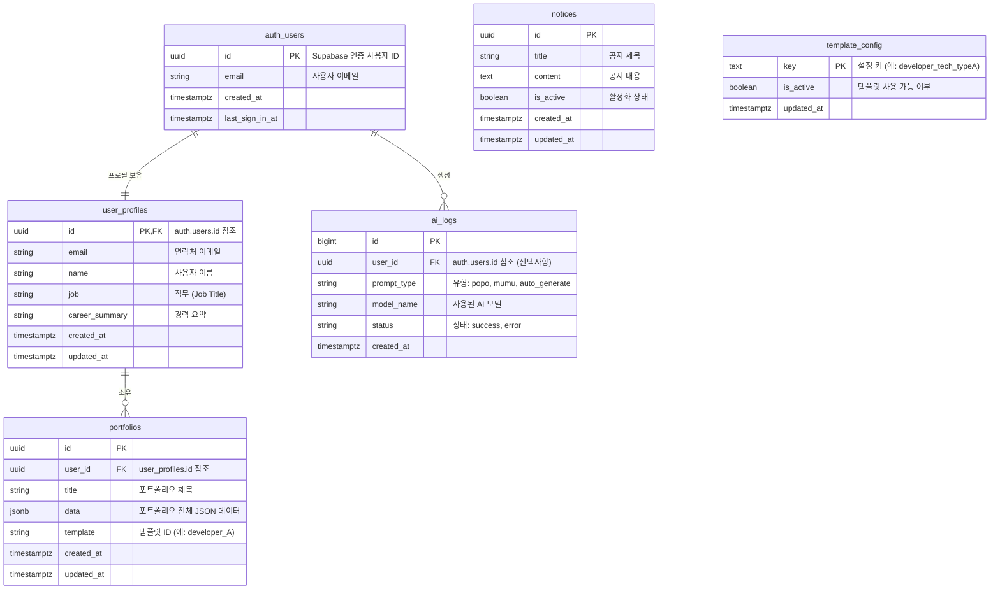

# 개체 관계 다이어그램 (ERD)

## 개요 (Overview)
데이터 스키마는 주로 **Supabase (PostgreSQL)** 에서 관리됩니다. 아래는 환경 설정 및 데이터베이스 스키마를 기반으로 한 핵심 엔터티와 그 관계를 나타낸 ERD입니다.

## ERD 다이어그램

## 테이블 설명 (Table Descriptions)

### 핵심 테이블 (Core Tables)
| 테이블 | 설명 |
|-------|-------------|
| **`auth.users`** | Supabase Auth에서 관리. 인증 자격 증명 및 신원 정보를 저장합니다. |
| **`user_profiles`** | 애플리케이션 전용 사용자 정보를 저장합니다. `auth.users`와 1:1로 연결됩니다. |
| **`portfolios`** | 생성된 포트폴리오 데이터를 저장합니다. 한 사용자가 여러 포트폴리오를 가질 수 있습니다 (현재는 단일 활성 포트폴리오에 최적화됨). |

### 시스템 테이블 (System Tables)
| 테이블 | 설명 |
|-------|-------------|
| **`ai_logs`** | 프롬프트 유형 및 모델 성능을 포함한 AI 사용 통계를 기록합니다. 관리자 분석용으로 사용됩니다. |
| **`notices`** | 관리자가 관리하는 시스템 전체 공지사항을 저장합니다. |
| **`template_config`** | 다양한 포트폴리오 템플릿의 활성화 상태를 동적으로 관리합니다. |
